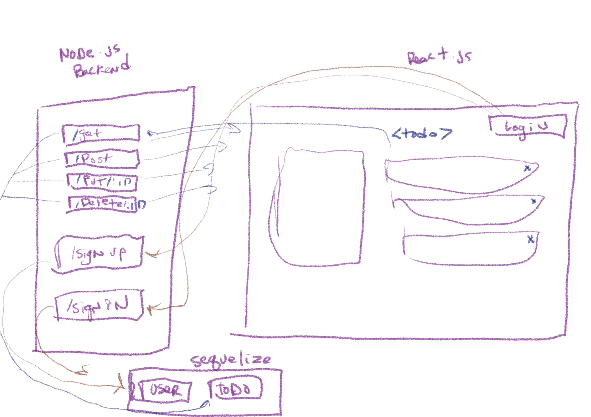

# todo-backend
# todo
# Lab - Class 31

## Author: Tek Jones

## Deployment and test
  * [test report]()
  * [deployment lab31](https://codesandbox.io/s/confident-nightingale-irutc)
  * [deployment lab32](https://codesandbox.io/s/gallant-taussig-x0cup)
  * [deployment lab33](https://codesandbox.io/s/crazy-wildflower-dkcps)
  * [deployment lab34](https://codesandbox.io/s/laughing-murdock-fwil5)
  * [deployment lab34 backend](https://todo-backend34.herokuapp.com/)

  
## About
- To do list manager
- A Web Application for securely managing a To Do List

## Setup

## Running the app
  * npm start

## Test
* npm test

### Phase 4
- We will finalize the functionality of the application by connecting to live servers for login, authorization, and data access

### Technical Requirements
- Alter the Add, Toggle Complete, and Delete functions within your to do application to use your API instead of in memory state

    - Fetch the current list of items from the database on application start
    - Whenever you add/update/delete an item, refresh the state so the user can instantly see the change
        - Consider: Do you re-fetch from the server every time you make a change?
          -  If so, how?
          -  If not, how will you stay in sync?
- Alter the Login Context to use the server to login users instead of our mock users list

    - Be sure to store the token in state as well as in a cookie so you can reference it later

## UML
